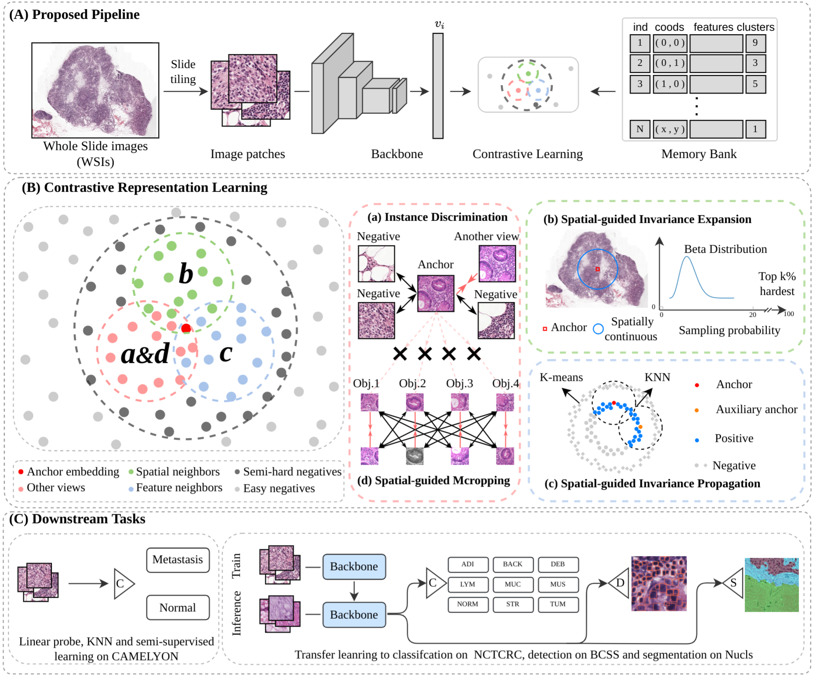

# SGCL: Spatial Guided Contrastive Learning on Whole-slide Pathological Images

This project hosts the code for implementing the SGCL algorithm for self-supervised representation learning on whole-slide pathological imaegs.

SCGL is based on our preliminary work
> [**SSLP: Spatial Guided Self-supervised Learning on Pathological Images**](https://link.springer.com/chapter/10.1007/978-3-030-87196-3_1),  
> Jiajun Li*, Tiancheng Lin*, Yi Xu  
> In *International Conference on Medical Image Computing
and Computer-Assisted Intervention.* (MICCAI), 2021   

## Highlights
<!--  -->
- **Novel method:** SGCL is a novel self-supervised learning method for whole-slide pathological images to explore the intra-invariance, inter-invariance and inner-invariance beyond the self-invariance of instance discrimination.
- **Exploring two intrinsic properties:** Spatial-propagated invariance and multi-object prior behind the WSIs are leveraged for designing the pretext tasks.
- **Loss function:** A new loss function is proposed and validated via a theoretical analysis. 
- **SOTA performance:** The proposed method achieves state-of-the-art performance on multiple pathological datasets and tasks.

## Installation
Please refer to [INSTALL.md](docs/INSTALL.md) for installation and dataset preparation.

## Main results
We conduct several evalutions on [**Camelyon16**](https://camelyon16.grand-challenge.org), [**NCTCRC**](https://zenodo.org/record/1214456), [**Nucls**](https://nucls.grand-challenge.org/NuCLS), [**BCSS**](https://bcsegmentation.grand-challenge.org).

**Note:** 
- The metrics for VOC det and seg are AP (COCO-style) and mIoU. The results are averaged over 3 trials.
- The training time is measured on 4 3090 Ti GPUs.
- See our paper for more results on different benchmarks.

## Usage

### Training
    CUDA_VISIBLE_DEVICES=0,1,2,3 PORT=29504 \
    bash tools/dist_train.sh configs/selfsup/sgcl/npidsgclmcrop.py 4 \
    --work_dir ./work_dirs/selfsup/npidsgclmcrop

### Extracting Backbone Weights
    WORK_DIR=work_dirs/selfsup/sgcl/npidsgclmcrop.py/
    CHECKPOINT=${WORK_DIR}/epoch_100.pth
    WEIGHT_FILE=${WORK_DIR}/extracted_sgcl_camelyon_100ep.pth
    
    python tools/extract_backbone_weights.py ${CHECKPOINT} ${WEIGHT_FILE}

### Transferring to Object Detection and Segmentation
Please refer to [README.md](benchmarks/detection/README.md) for transferring to object detection and semantic segmentation.
### Tips
- After extracting the backbone weights, the model can be used to replace the original ImageNet pre-trained model as initialization for many prediction tasks. 
- If your machine has a slow data loading issue, especially for ImageNet, your are suggested to convert ImageNet to lmdb format through [folder2lmdb_imagenet.py](tools/folder2lmdb_imagenet.py) or  [folder2lmdb_coco.py](tools/folder2lmdb_coco.py), and use this [config_imagenet](configs/selfsup/densecl/densecl_imagenet_lmdb_200ep.py) or [config_coco](configs/selfsup/densecl/densecl_coco_lmdb_800ep.py) for training. 

## Acknowledgement
We would like to thank the [OpenSelfSup](https://github.com/open-mmlab/OpenSelfSup) and [DenseCL](https://github.com/WXinlong/DenseCL) for their open-source projects, [PyContrast](https://github.com/HobbitLong/PyContrast) for its detection evaluation configs .

## Citations
Please consider citing our paper in your publications if the project helps your research. BibTeX reference is TBD.
